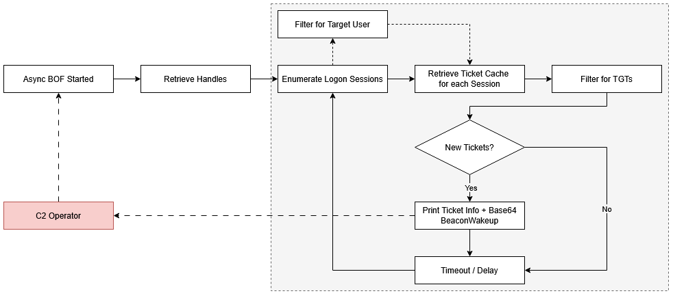
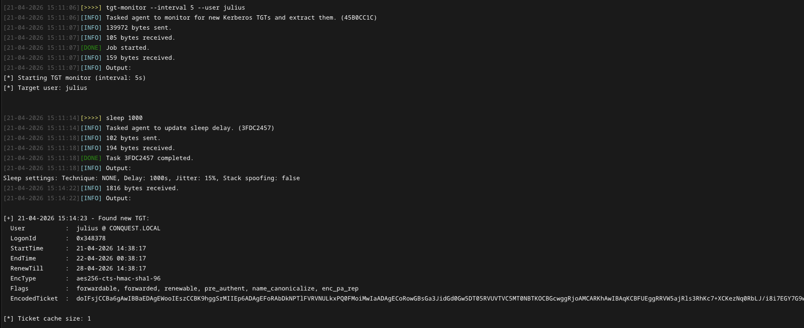
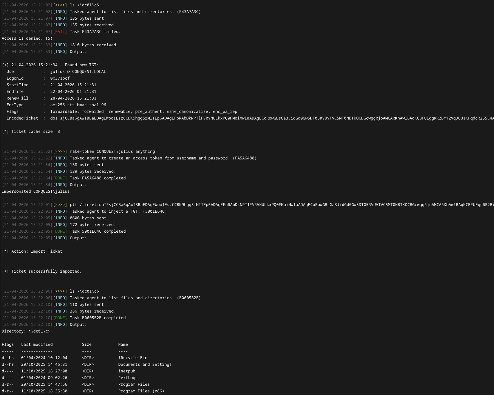

# Kerberos TGT Monitor BOF

Async Beacon Object File (BOF) that monitors for Kerberos logon events and wakes up the agent whenever a new Kerberos TGT is captured. Similar to Rubeus' `monitor` command, this BOF is running indefinitely and periodically checks the LSA ticket cache on the system. When a new TGT is detected, it prints the ticket metadata and outputs a base64-encoded kirbi blob that can be used for lateral movement via pass-the-ticket attacks.

>[!Important]
> This BOF requires asynchronous object file loading capabilities as it relies on the `BeaconWakeup` API to force an agent to check in when a new TGT is captured. Such functionality is provided by the [Conquest](https://github.com/jakobfriedl/conquest/) framework. 

## Workflow

In Conquest, the `tgt-monitor` BOF is executed in the background via a self-contained COFF loader DLL. The execution involves the following key steps:  



## Usage


>[!Warning]
> This BOF needs to be run from a `NT AUTHORITY\SYSTEM` context. 

The following arguments need to be passed to the object file: 

| Name | Type | Description | 
| --- | --- | --- |
| `interval` | `int` | Timeout between checks in seconds. | 
| `targetUser` | `string` | Case-insensitive username of a specific target user. When this field is set, only TGTs for that user are retrieved. Otherwise, TGTs are collected for all users. Note that computer accounts need to end with a `$`. |

For ease-of-use, this repository features a [Conquest Module](./dist/tgt-monitor.py) that implements the following command.  

```
Usage: tgt-monitor [--interval interval] [--user user]
Example: tgt-monitor --interval 5 --user DC01$

Optional arguments:
  --interval interval       INT        Polling interval in seconds (default: 60).
  --user user               STRING     Target specific username only.
```




The encoded ticket can be used directly with `Rubeus.exe ptt /ticket:<base64>` or `impacket-ticketConverter` for further lateral movement, as shown in the screenshot below. In [Conquest](https://github.com/jakobfriedl/conquest/), it is possible to use the `ptt` command to directly inject the ticket into the current logon session to impersonate the target user. 



## Compilation

```bash
make
```

## Acknowledgements 

This implementation of this Beacon Object File is based on the following projects: 

- https://github.com/Ghostpack/Rubeus
- https://github.com/RalfHacker/Kerbeus-BOF
- https://github.com/wavvs/nanorobeus

