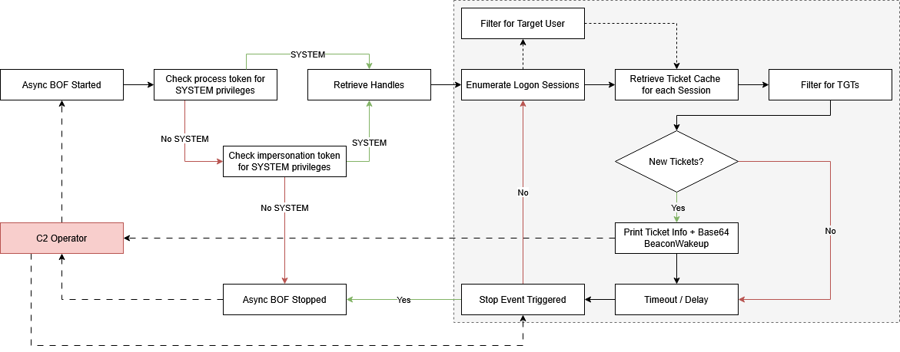
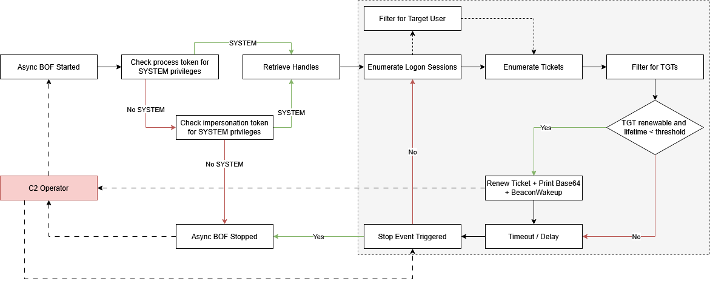

# Kerberos TGT Monitoring & Auto-Renewal

This repository contains two Async Beacon Object Files (BOF). The first, `tgt-monitor`, monitors the system for Kerberos logon events and wakes up the agent whenever a new Kerberos TGT is captured. Similar to Rubeus' `monitor` command, this BOF is running indefinitely and periodically checks the LSA ticket cache on the system. When a new TGT is detected, it prints the ticket metadata and outputs a base64-encoded kirbi blob that can be used for lateral movement via pass-the-ticket attacks. The second, `tgt-renew`, automatically renews TGTs on the system if their remaining lifetime is below a specified threshold (e.g. 15 minutes). 

>[!Important]
> The BOFs in this repository require asynchronous object file loading capabilities. Such functionality is provided by the [Conquest](https://github.com/jakobfriedl/conquest/) framework. 

- [Kerberos TGT Monitoring \& Auto-Renewal](#kerberos-tgt-monitoring--auto-renewal)
  - [How it Works](#how-it-works)
    - [Ticket Monitoring](#ticket-monitoring)
    - [Ticket Renewal](#ticket-renewal)
  - [Usage](#usage)
    - [tgt-monitor](#tgt-monitor)
    - [tgt-renew](#tgt-renew)
  - [Installation](#installation)
  - [Acknowledgements](#acknowledgements)


## How it Works

Both BOFs require to be run from a `NT AUTHORITY\SYSTEM` context. The privileges are checked following the same logic.

1. The BOF checks the current process token for SYSTEM access.
2. If the process token is not SYSTEM, the BOF scans all threads in the current process for an impersonation token with SYSTEM privileges and duplicates it. This allows use from a low-integrity agent process that has stolen a SYSTEM token (e.g. via `SeImpersonatePrivilege`). The BOF terminates if this also does not yield SYSTEM level access.
3. LSA and Kerberos authentication package handles are retrieved.

The steps below are repeated in a loop until the BOF is cancelled via the stop event. A user-defined interval sets the delay between polls.

### Ticket Monitoring

4. All active logon sessions are enumerated. For each session, the Kerberos ticket cache is queried and filtered for TGTs. If a `--user` argument was provided, only sessions matching that username are considered.
5. The current ticket cache is diffed against the previous snapshot. New TGTs trigger metadata printing and base64-encoded kirbi output, followed by a `BeaconWakeup()` call to force the agent to check in and return the output.



### Ticket Renewal

4. All active logon sessions are enumerated. For each session, the Kerberos ticket cache is queried and filtered for TGTs. If a `--user` argument was provided, only sessions matching that username are considered.
5. Each TGT is checked against two conditions:
   - If the ticket is past its `RenewUntil` time, it is flagged as expired and re-authentication is required.
   - If the ticket's remaining lifetime is within the user-defined threshold, the TGT is renewed and imported. On success, the updated ticket metadata and base64-encoded kirbi output are printed, followed by a `BeaconWakeup()` call.
  


The ticket renewal process involves the following steps: 

1. Extract the ASN.1 encoded Kerberos TGT via ExtractTicket() using the LUID and SPN from the PTICKET_ENTRY structure.
2. ASN.1-decode the ticket and retrieve the Kerberos credential.
3. Create a TGS-REQ packet to request the ticket renewal using the expiring ticket for preauthentication.
4. Send the TGS-REQ bytes to the domain controller on port 88.
5. Retrieve, ASN.1-decode and parse the TGS-REP response.
6. Build the renewed ticket, purge the old ticket from the cache, and import the renewed ticket using Pass-the-Ticket.
7. Update startTime, endTime, renewUntil, ticketFlags, and encryptionType on the PTICKET_ENTRY structure, print the ticket information & base64.

## Usage

This repository features a [Conquest Module](./dist/tgt-monitor.py) that implements the following two commands.  

### tgt-monitor

The `tgt-monitor` BOF alerts when new TGTs are captured and returns them as a Base64-encoded blob. The following arguments need to be passed to the object file: 

| Name | Type | Description | 
| --- | --- | --- |
| `interval` | `int` | Timeout between checks in seconds. | 
| `targetUsers` | `string` | Case-insensitive comma-separated list of target usernames. When this field is set, only TGTs for the specified users are retrieved. Otherwise, TGTs are collected for all users. Note that computer accounts need to end with `$`. |


```
Usage: tgt-monitor [--interval interval] [--user user]
Example: tgt-monitor --interval 5 --user DC01$

Optional arguments:
  --interval interval       INT        Polling interval in seconds (default: 60).
  --user user               STRING     Comma-separated list of target usernames (default: all users).
```


The encoded ticket can be used directly with `Rubeus.exe ptt /ticket:<base64>` or `impacket-ticketConverter` for further lateral movement, as shown in the screenshot below. In [Conquest](https://github.com/jakobfriedl/conquest/), it is possible to use the `ptt` command to directly inject the ticket into the current logon session to impersonate the target user. 


### tgt-renew

The `tgt-renew` BOF automatically renews tickets that expire soon until they can no-longer be renewed. The following arguments need to be passed to the object file: 

| Name | Type | Description | 
| --- | --- | --- |
| `interval` | `int` | Timeout between checks in seconds. | 
| `targetUsers` | `string` | Case-insensitive comma-separated list of target usernames. When this field is set, only TGTs for the specified users are retrieved. Otherwise, TGTs are collected for all users. Note that computer accounts need to end with `$`. |
| `threshold` | `int` | Renewal threshold in minutes. The ticket is renewed when the time to EndTime is lower than this threshold. | 

```
Usage: tgt-renew [--interval seconds] [--threshold minutes] [--user user]
Example: tgt-renew --interval 300 --threshold 30

Optional arguments:
  --interval seconds        INT        Polling interval in seconds (default: 60).
  --threshold minutes       INT        Ticket renewal threshold in minutes (default: 15).
  --user user               STRING     Comma-separated list of target usernames (default: all users).
```

## Installation

```bash
git clone https://github.com/jakobfriedl/tgt-monitor-bof
cd tgt-monitor-bof
make
```

From there, use Conquest's Script Manager to load the dist/tgt-monitor.py module.

## Acknowledgements 

This implementation of this Beacon Object File is based on the following projects: 

- https://github.com/Ghostpack/Rubeus
- https://github.com/RalfHacker/Kerbeus-BOF
  - ASN.1 encoding/decoding implementation
- https://github.com/wavvs/nanorobeus